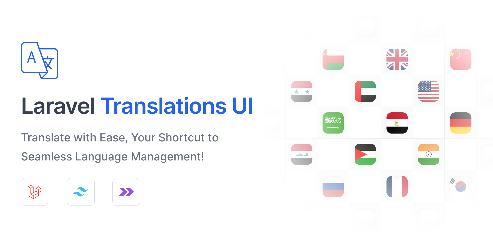
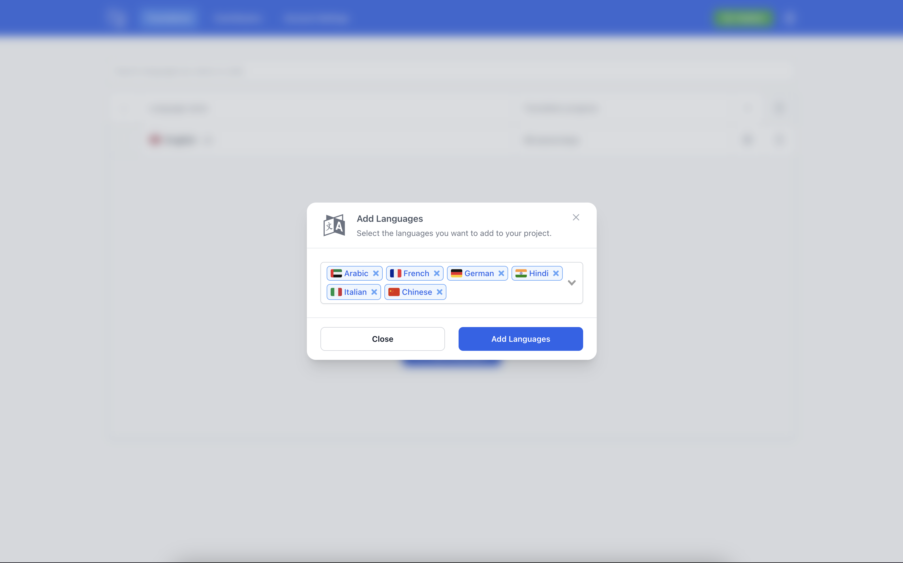
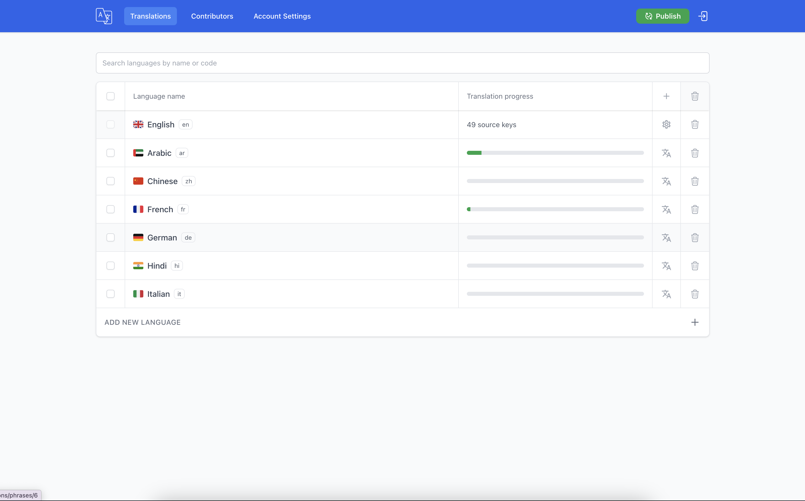
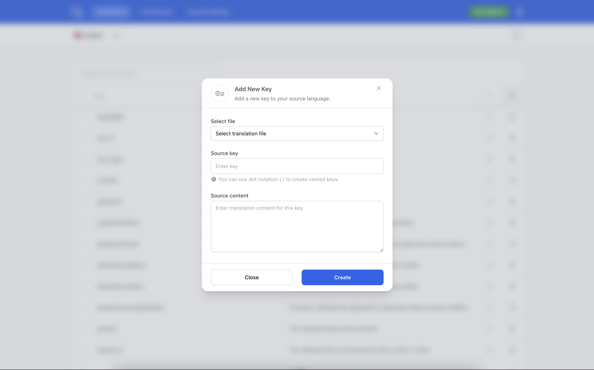
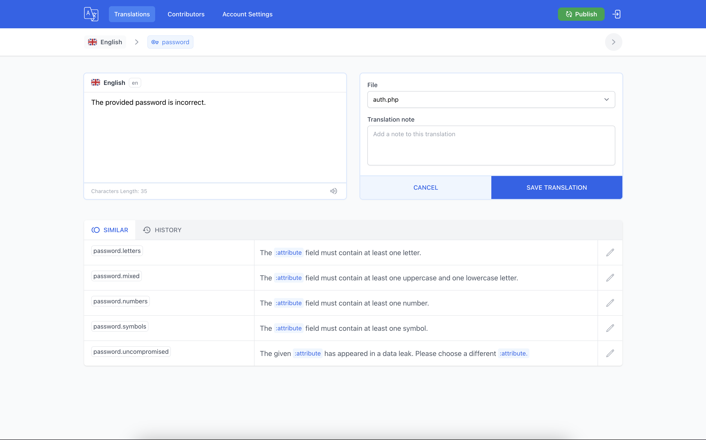
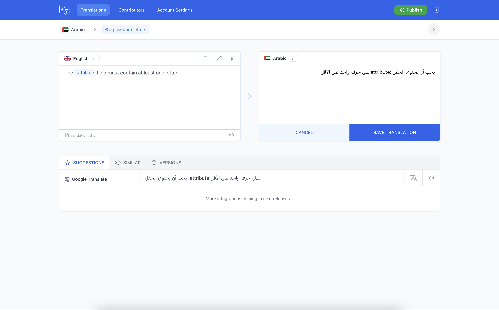
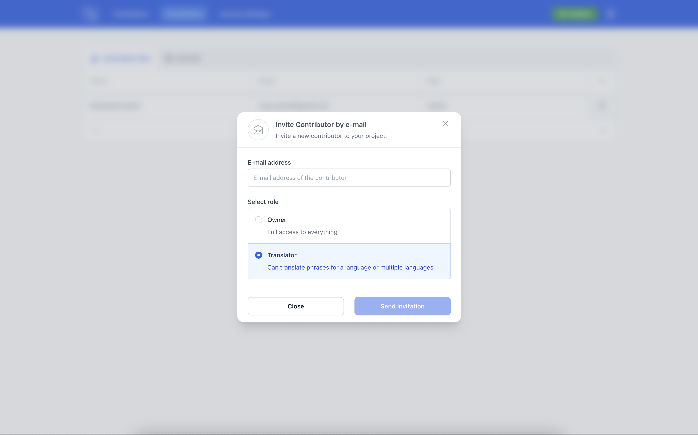
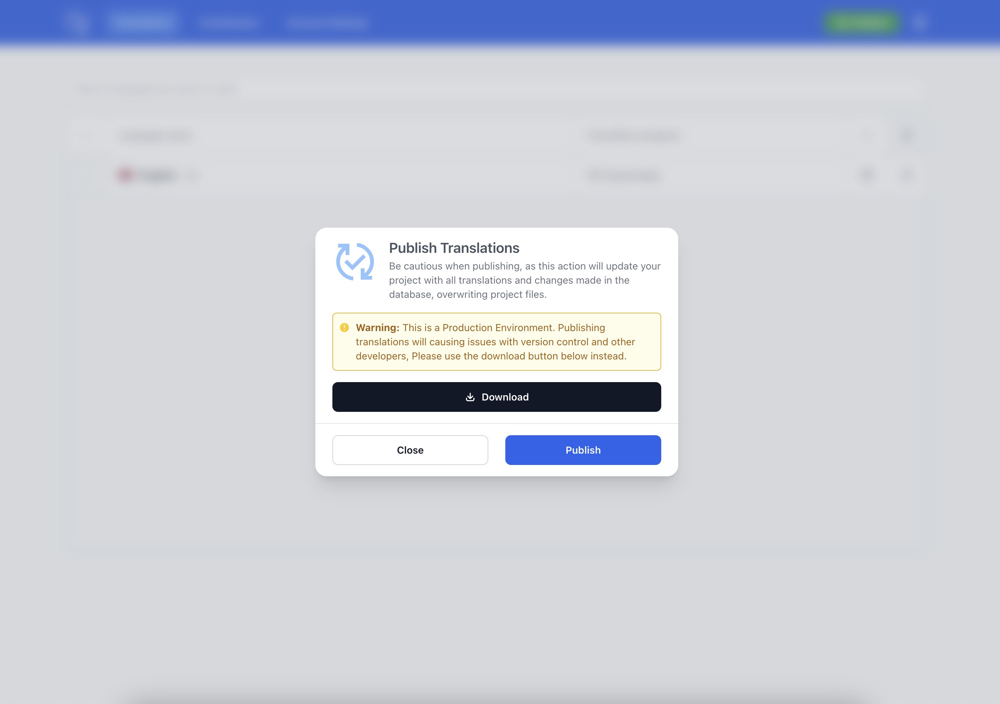

<p align="center">
    <a href="#introduction">Introduction</a> |
    <a href="#roadmap">Roadmap</a> |
    <a href="#installation">Installation</a> |
    <a href="#usage">Usage</a> |
    <a href="#upgrading">Upgrade</a> |
    <a href="#changelog">Changelog</a>
</p>

<p align="center">
<a href="https://packagist.org/packages/outhebox/laravel-translations"></a>
<a href="https://github.com/MohmmedAshraf/laravel-translations/actions?query=workflow%3Arun-tests"></a>
<a href="https://packagist.org/packages/outhebox/laravel-translations"></a>
<a href="https://packagist.org/packages/outhebox/laravel-translations"></a>
<a href="https://packagist.org/packages/outhebox/laravel-translations"></a>
</p>

### Introduction

Laravel Translations UI package provides a user-friendly interface for managing translations in your Laravel application. It simplifies tasks such as adding, editing, deleting, and exporting translations. The package also includes a handy search feature and the ability to invite collaborators for easy translation management. Currently, the package is integrated with the Google Translate API, allowing you to translate your content into any language of your choice.

> 📺 **[Watch a 4-minute video by Povilas Korop](https://www.youtube.com/watch?v=lYkgXnwnVbw)** showcasing the package.

---

## Support the Project

[](https://outhebox.dev/github-ad-click/laravel-translations).

Thank you for considering supporting the development of this package! If you'd like to contribute, you can buy me a coffee or sponsor me to help keep me motivated to continue improving this package. You can also support the project by starring ⭐ the repository.

To buy me a coffee, click the button below:

<a href="https://www.buymeacoffee.com/outhebox" target="_blank"></a>

### Requirements
> **Requires [PHP 8.2+](https://php.net/releases/) and [Laravel 11.x](https://laravel.com/docs/11.x/installation)**

### Features
- Easily view, create, and delete translations with an intuitive interface.
- Effortlessly manage translation keys for organized language management.
- Conveniently filter by translation keys or values to quickly locate specific content.
- Seamlessly import and export translations to and from your Laravel application
- Utilize a powerful search function to swiftly find the translations, keys, or values you need.
- Collaborate seamlessly by inviting contributors to manage translations collaboratively.
- Benefit from Google Translate API integration for accurate and automated language translation.
- Explore additional features that enhance your translation workflow and more.

### Roadmap
- [x] Add tests.
- [x] Improve the UI.
- [ ] Vendor translations support.
- [x] Google Translate API integration.
- [x] Invite collaborators to manage translations.
- [ ] Add revision history.
- [ ] Add more features.

### Installation

🚨 **Important Notice: Breaking Changes in this Version** 🚨

I would like to inform you that this version brings about substantial breaking changes, as the package stack has transitioned from [Livewire](https://livewire.laravel.com/) to [Inertia](https://inertiajs.com/). This adjustment brings several improvements and optimizations, enhancing the overall performance and user experience.

To seamlessly adapt to these changes, please follow the steps below:

#### Uninstall the Previous Version
I've added a new command to help you uninstall the package and remove all its assets and configuration files and clean up the database, but please make sure to double-check that everything has been removed before proceeding with the installation of the new version, as this command is still in beta. To uninstall the package, run the following command:

```bash
php artisan translations:clean
```

Alternatively, you can manually remove the package by following these steps:

```bash[.env](..%2Ftestapp%2F.env)
composer remove outhebox/laravel-translations
```

#### Install from Scratch

After uninstallation, perform a fresh installation of the package.

```bash
composer require outhebox/laravel-translations --with-all-dependencies
```

Before you can access the translations UI, you'll need to publish the package's assets and migrations files by running the following command:

```bash
php artisan translations:install
```

### Usage

To import your translations, run the following command:

```bash
php artisan translations:import
```

To import and overwrite all previous translations, use the following command:

```bash
php artisan translations:import --fresh
```

To access the translations UI, visit `/translations` in your browser. If you are using a production environment, you will need to create owner user first. To do so, run the following command:

```bash
php artisan translations:contributor
``` 

This command will prompt you to enter the user's name, email, and password. Once you have created the owner user, you can log in to the translations UI dashboard and start managing your translations.

#### Exporting Translations

You can export your translations from the translations UI dashboard or by running the following command:

```bash
php artisan translations:export
```

### Configuration
You can configure the package and set your base language by publishing the configuration file:

```bash
php artisan vendor:publish --tag=translations-config
```

This will publish the `translations.php` configuration file to your `config` directory.

### Upgrading

When upgrading to a new major version of Laravel Translations UI, it's important that you carefully review the upgrade guide.

In addition, when upgrading to any new Translations UI version, you should re-publish Translations UI assets:

```bash
php artisan translations:publish
```

To keep the assets up-to-date and avoid issues in future updates, you may add the translations:publish command to the post-update-cmd scripts in your application's composer.json file:

```json
{
    "scripts": {
        "post-update-cmd": [
            "@php artisan translations:publish --ansi"
        ]
    }
}
```

### Screenshots
















### Changelog

Please see [CHANGELOG](CHANGELOG.md) for more information on what has changed recently.

### Contributing

Please see [CONTRIBUTING](CONTRIBUTING.md) for details.

## Credits

- [Mohamed Ashraf](https://github.com/MohmmedAshraf)
- [All Contributors](../../contributors)

### License

The MIT License (MIT). Please see [License File](LICENSE.md) for more information.
